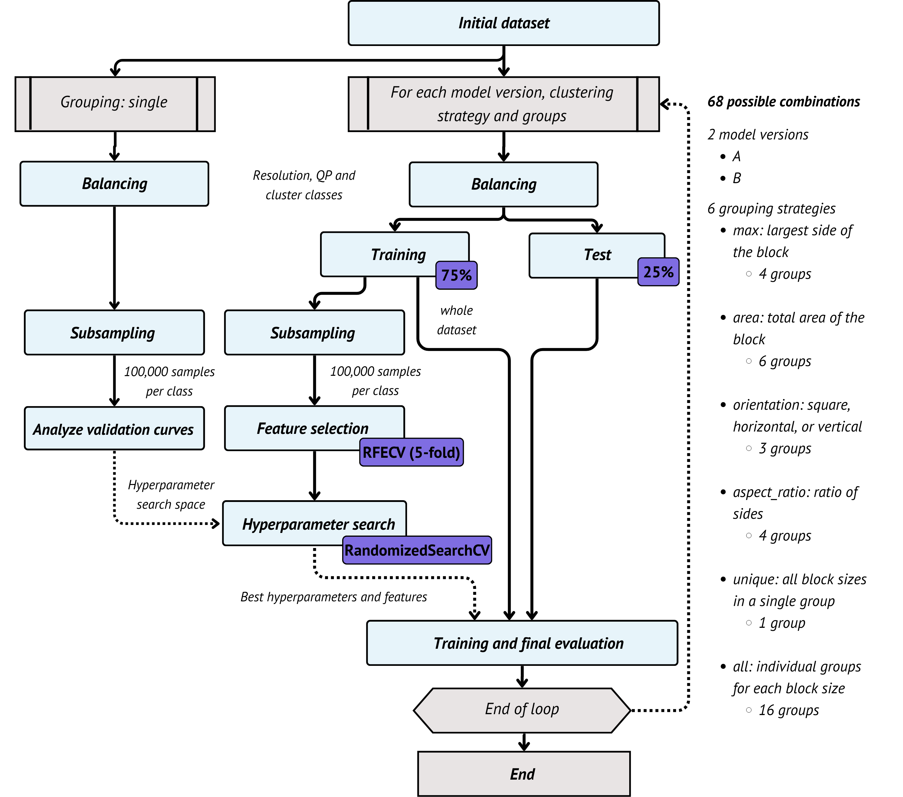
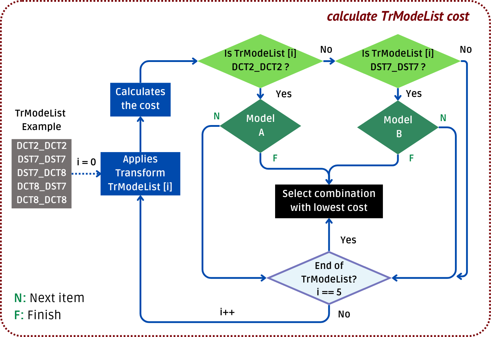

# 📂 vvc-transform-dtree-classifier
A **Decision Tree-based classifier** for transform decisions in the VVC encoder.  
Includes **feature selection via RFECV**, **hyperparameter optimization**, and **clustering strategies based on block structure**.  

---

## 🔄 Processing Pipeline

The training and evaluation process follows these steps:

1. **Data Loading**: Read CSV file.  
2. **Clustering**: Apply the chosen block grouping strategy.  
3. **Preparation**: Perform class balancing and train/test split (75%/25%).  
4. **Feature Selection**: RFECV with 5-fold cross-validation.  
5. **Hyperparameter Optimization**: Randomized search (100 iterations).  
6. **Training**: Train the final model using the best parameters.  
7. **Evaluation**: Generate classification report and accuracy scores.  
8. **Export**: Convert the trained Decision Tree into C++ code.  

---

## 📊 Clustering Strategies

Clustering strategies were designed to balance **generalization** and **specialization**, enabling a broader assessment of how grouping impacts model performance:

- **max**: Groups blocks by their largest dimension (width or height). Produces groups: `4x4`, `8x8`, `16x16`, `32x32`.  
- **area**: Groups blocks by area (width × height). Produces groups: `16`, `32`, `64`, `128`, `256`, `512`.  
- **orientation**: Categorizes blocks into **Square**, **Horizontal** (width > height), or **Vertical** (height > width).  
- **aspect ratio**: Groups based on width-to-height ratio: `1:1`, `2:1`, `4:1`, `8:1`.  

Additionally, two extreme strategies were included:  

- **single**: All blocks belong to a single group.  
- **all**: Every block size combination among `{4, 8, 16, 32}` is considered separately, totaling 16 groups:  
  `4x4`, `4x8`, `4x16`, `4x32`, `8x4`, `8x8`, `8x16`, `8x32`, `16x4`, `16x8`, `16x16`, `16x32`, `32x4`, `32x8`, `32x16`, `32x32`.  

---

## 🔬 Supported Models

Based on the **VTM encoder execution flow** and the **frequency of applied transforms**, two predictive models were designed:

- **Model A**: Acts as a filter immediately after **DCT-II\_DCT-II**.  
  Decides whether to **stop evaluation early** (choosing DCT-II\_DCT-II) or **continue testing more transforms**.  

- **Model B**: Triggered if Model A allows continuation.  
  Decides whether to test only **DST-VII\_DST-VII** (2nd most frequent) or extend evaluation to **all remaining transform candidates**.  

Integration of these models into the encoder is shown in **Figure**, and their behaviors are summarized below:  

---

### 🧩 Decision Behavior of the Models

| **Model** | **Decision** | **Transforms Tested** |
|-----------|--------------|------------------------|
| Model A   | Stop after DCT-II\_DCT-II | Only DCT-II\_DCT-II |
| Model A   | Continue testing | Passes control to Model B |
| Model B   | Restrict search  | Adds DST-VII\_DST-VII |
| Model B   | Extend search    | Tests all remaining combinations |

---

## ⚙️ Implementation Notes

- Feature selection is performed using **Recursive Feature Elimination with Cross-Validation (RFECV)**.  
- Hyperparameter optimization uses **RandomizedSearchCV** over Decision Tree parameters.  
- Logging is included for monitoring data processing, training, and evaluation.  
